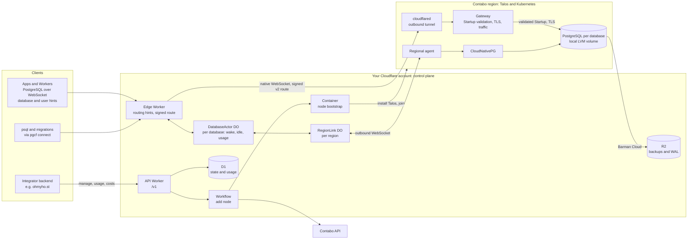

# cloudflare-postgres

Open-source, Neon-style serverless PostgreSQL that runs on **your Cloudflare account** and **your
Contabo VPS**. Cloudflare runs the whole control plane and is the only way into the databases.
The VPS run real, unmodified PostgreSQL under CloudNativePG. The approved initial deployment
retains the EU control/relay VPS and the already-admitted EU customer worker, now **EU1**
(formerly EU2), and adds one US control-plane/customer VPS, **US1**. Both customer servers use
**V159 / Cloud VPS Plus 4: 4 vCPU, 8 GiB RAM and 150 GiB NVMe**. US1 was purchased through the
API for one month. EU1 keeps its existing installation, identity and data. System and platform
resources remain protected; server loss is recovered from R2.

- Create, resize, suspend, restore and delete databases through a versioned API.
- Connect through Cloudflare: PostgreSQL over WebSocket. The VPS expose no database port.
- Databases sleep when idle and wake on the next connection.
- Continuous backups to R2 with point-in-time recovery.
- Usage and infrastructure-cost metrics per database. You put your own pricing on top.
- Capacity and Contabo provisioning are implemented; complete autonomous admission and standing-policy activation remain under acceptance.

[ohmyho.st](https://ohmyho.st) is the first adopter. Its Neon migration follows operator acceptance;
existing customer databases remain on Neon until their separate migration is accepted.

## Status

**Overall product completion remains open (2026-10-08 correction).** The EU/US database lifecycle
and RAM-trigger tests passed, but uniform fleet configuration, automatic admission, patch management
and the approved fast-start architecture are incomplete. See the
[unified corrective plan](docs/architecture/cloudflare-convergence-and-serverless-plan.md).
The earlier broad completion statement is withdrawn. The following are partial Dev results. Both EU nodes and
all five Flux releases are Ready, with 95 GiB measured storage per node. The complete Dev path through
`db.ohmyho.st` reaches real PostgreSQL with verified TLS, continuous WAL archiving and R2 backups.

Real E0–E6 passed, including complete TCP port scans of the observed node IPv4 from both sources.
Five create/delete runs survived ten agent restarts with complete storage cleanup. Empty, failed,
stale and out-of-order desired-state responses preserved storage and configuration generations.
Loss of a ready database namespace reported recovery required rather than creating empty storage.
The R2 outage test proved two failing archive observations under the active block and a successful
new connection during the alarm. A separate restore drill preserved committed markers, omitted
a rolled-back marker and reclaimed its target storage. API full restore, PITR and restore after
source deletion have passed. EU capacity expansion, signed network verification and placement on
both nodes have passed. US operator admission and cross-region recovery with the healthy EU
source preserved have passed; the real76% RAM-rule test passed and automatic postjoin remains open.

Raw 100 MiB and 1 GiB stream checks, slow reception and 600 seconds idle passed. A 10-second
read load measured 735.604 SQL/s over 50 warmed connections, p95 75.368 ms and zero errors.
These observations do not establish maximum throughput or 1,000-customer capacity. Deployed Actor admission rejects unregistered routing hints before D1; the Edge no longer has a D1 binding. Known routes still require current authoritative D1. Default-text clients and raw COPY pass; decoded binary-result
assertions remain failed on WebSocket and direct TCP with node-postgres 8.22. Intermittent Tail
correlation remains unresolved.

The installable CLI passed real psql transactions, rollback and 105 MB binary COPY integrity.
CPU placement and Actor admission are deployed. A real resize to 512 MiB/250 millicores completed
in 28 seconds with unchanged storage and data; storage-changing resize is refused. Persistent
gateway fences survived a gateway replacement, and a fresh database verified the internal
maintenance role's TLS and minimal grants. Usage rollups and lifecycle API/Actor logic are
implemented. Manual Dev suspend/resume preserved data and storage and verified closed WAL in R2.
Automatic idle sleep and one wake for ten concurrent connections passed in Dev. Instrumented cold
connections have a twenty-run p50/p95/max of 8.412/9.160/9.708 seconds, accepted by the owner for v1.
The owner-approved [Rust runtime and cold-start architecture](docs/architecture/rust-runtime-and-cold-starts.md)
requires native regional services, a Rust/Wasm Edge and a shared pool of prestarted unassigned
compute. Per-database warm reclaim is additional and cannot replace the pool; implementation
and Dev acceptance are pending. All twenty starts preserved data, the original cluster/claim and credential
UIDs/versions, and each caused one wake. The stale readiness snapshot
is corrected; a verified read-only SQL archive check is deployed, but the first complete cold
archive check still took 1.74 seconds. The finalized hourly awake-time measurement differs by
at most 19.748 seconds from independent Kubernetes evidence, within the 60-second requirement.
Unchanged credentials retain their UID/version through power revisions. A conservative new
observation window recovered actual idle sleep after a quiet gateway replacement. A later
unknown refusal safely restored running state; fixed-enum diagnostics now identify subsequent
refusals without copying exception bodies.
Twenty sequential connections plus a marker read on an always-warm Dev database measured
p95 734 ms and maximum 911 ms; this does not establish application or load-capacity latency.
The live collector
preserves its checkpoint across configuration changes and measures allocation while hibernated.
Actual R2 listing, archive summary and hourly backup usage agreed on 7,515,287 bytes.
The filesystem collector measured actual volume use in Dev. API full restore, PITR and restore
after source deletion passed with separate volumes, verified SQL and removed temporary admin access.
An isolated real Cloudflare admission probe refused excess registered attempts before D1 or wake.
US installation reached Ready through the owner-authorized operator path; cross-region recovery passed.
Missing samples stay unknown. Cost attribution is deferred.
The already-admitted second EU node is retained as customer EU1 and serves a real capacity-test
database. One matching V159 US1 was purchased through the API; its original-request audit and
allocated 4 vCPU, 8,192 MiB RAM and 153,600 MiB NVMe were verified. Provider Running still requires
Talos installation, Kubernetes admission and actual customer readiness. Its Cloudflare archive, scoped
credentials, private Tunnel, gateway service and regional identity are configured. Cross-region
restore is implemented, delivered and accepted on the retained EU/US nodes. The original EU/US 300 GB SSD
V155 orders were paid, then cancelled by the owner. A later V155 NVMe-selector API test also
allocated SSD and did not run an installer. Those failed selections are historical; the current
V159 offer supplies the required 150 GiB NVMe without a storage add-on. No new EU worker is needed,
and EU1 is not reset, re-adopted or decommissioned. The accepted R2 restore into US1 preserved the healthy EU source; the earlier destructive loss
and deletion kits remain outside this scope.
US1 is admitted through the owner-authorized operator postjoin/admission path, preserving its
original purchase and installation. EU1 and US1 passed real Cloudflare SQL/TLS, application roles,
R2 base backup/WAL, restore and deletion with physical reclamation. Automatic postjoin admission
remains open for the next genuine authorized node purchase. Preserve both EU nodes and their
existing data; do not re-adopt or reset US1. Neon migration remains separate and requires the
[customer handover gates](docs/operations/operator-installation.md#customer-migration-handover),
including credential rotation, adopter transport/rebinding and sufficient regional capacity.

The actual-RAM expansion threshold and automatic-purchase switch are operator settings exposed
through the authenticated Cloudflare management API. Expansion requires ten fresh aligned
consecutive minutes from every eligible customer node, each retaining its own Node UID.
Existing capacity remains eligible during rollout under hard RAM, CPU, storage and full
PostgreSQL/Barman startup-peak guards; there is no 81% placement cutoff. Missing observations
remain unknown. Fresh installations do not purchase automatically or send notifications.
An optional `max_nodes` limit can be removed with `null`; no fixed three-node ceiling is required.
This installation's selected standing policy remains V159, one month, no storage add-on and a
76% expansion threshold. Updating its live configuration and completing autonomous rollout
remain acceptance work. Monetary and lifetime order-count ceilings are optional under explicit
operator authority. The real RAM-threshold window and load cleanup passed.
See [PLAN.md](PLAN.md#11-status) for measured results and remaining work.

## Architecture

The programmed installer selects a provider-verified source once and retains its association in
Cloudflare across proof renewals. Renewed claims are short-lived; current job/binding authority,
host keys, TLS, Cluster UID, Node UID and fresh native identity readbacks still fence execution.
Kubernetes/Talos commands, transport grants and proof cleanup must make zero Contabo calls.
Routine signed-proof admission likewise uses current Cloudflare/R2 custody. Fresh provider
address and read-only firewall checks fence the first destructive installation checkpoint.
Contabo remains at purchase, initial inventory/firewall/rescue, hypervisor and uncertain-provider
resolution boundaries, including fresh verification before the first destructive write. Its
credential-scoped client reuses and coalesces OAuth until early expiry or 401 invalidation;
credential changes replace the client. Uncertain mutations are never replayed. The API repair is
deployed and the programmed cleanup has removed the old owned probe namespaces. Fresh US proof
now has a verified global IPv6/default-route prerequisite on the retained source host. Bounded
failed-Pod diagnostics preserve recognized scanner codes before cleanup. Freshly authenticated
TLS control connections retain signed source identity. Gateway ICMPv6 permits neighbor discovery.
Completed scan observations remain fresh at report admission; historical start/control times are
bounded against scan completion. Owned cleanup inventories the same 13 resource collections through
bounded direct Kubernetes reads, without discovery, and refuses incomplete or foreign resources.
The producer waits if the retained source observation is stale, while transport access remains
refused. Real fresh observations permit new bounded authority for that same source; changed
identities remain blocking and the freshness limit is unchanged.
The original US node remains Ready through the owner-authorized operator path. Autonomous
addition and the corrective common-runtime acceptance remain outstanding in PLAN.md.



Connecting to a sleeping database:

```mermaid
sequenceDiagram
  participant C as Client
  participant E as Edge Worker
  participant A as DatabaseActor
  participant R as RegionLink
  participant G as Regional agent
  participant P as PostgreSQL

  C->>E: GET /v2?database=id&user=role (untrusted hints)
  E->>A: ensureAwake()
  A->>R: wake (coalesced)
  R->>G: wake db-id
  G->>P: remove CNPG hibernation
  P-->>G: ready
  G-->>R: observed ready
  R-->>A: ready
  A-->>E: awake
  E->>P: native WebSocket via Tunnel and gateway (signed v2 route)
  C->>P: gateway validates Startup; PostgreSQL SCRAM end to end
```

| Part                  | Where                | Job                                                                                    |
| --------------------- | -------------------- | -------------------------------------------------------------------------------------- |
| API Worker            | Cloudflare           | `/v1` API, D1 state, Durable Objects, Workflows, usage rollups                         |
| Edge Worker           | Cloudflare           | Database endpoint: Actor admission, wake, signed route, native forwarding              |
| Regional agent        | Kubernetes           | Reconciles databases into CNPG resources; hibernate/wake; reports status and samples   |
| Gateway + cloudflared | Kubernetes           | Entry from Cloudflare; startup validation before PostgreSQL dial, TLS, stream counters |
| Node bootstrap        | Cloudflare Container | Turns a Contabo VPS into a Talos node                                                  |
| Platform              | Kubernetes (Flux)    | Cilium, OpenEBS LocalPV LVM, cert-manager, CloudNativePG, Barman Cloud plugin          |

The approved client endpoint is `GET /v2?database=<id>&user=<role>` on the single database hostname.
Configure the Neon serverless driver's `Pool`/`Client` WebSocket mode with `pipelineConnect=false`
and a `wsProxy` URL containing both URL-encoded hints. Requests to the bare `/v2` endpoint or with
missing or invalid hints are unsupported. Actor admission checks the database and role against D1; Edge signs a
v2 routing token with mandatory user, and returns the unopened upstream WebSocket for native
forwarding. Admission failures return a small failure-only `101` WebSocket carrying a PostgreSQL
SQLSTATE error before any gateway upgrade or PostgreSQL dial. Dev uses a VPC HTTP service with
native forwarding; VPC TCP raw streams were unsuitable, and a signed Tunnel route is the fallback.

The gateway checks the actual PostgreSQL StartupMessage database and user against the signed
route before opening PostgreSQL. It owns SSL/GSS preludes, CancelRequest, startup parsing and the
startup deadline, negotiates verified TLS to PostgreSQL, and measures stream bytes and connection
events. SCRAM authentication runs end to end with PostgreSQL; uncertain writes are never replayed.

### PostgreSQL tools

Build the CLI from this checkout with `pnpm --filter @pgcf/cli build`, then run:

```sh
node packages/cli/dist/main.js connect --endpoint wss://db.your-domain --database <db-id> --user app
```

Use the printed loopback port in psql or migration tools, with `host=127.0.0.1`, your database
and user, and `sslmode=disable`. Enter the password in the PostgreSQL tool. The local hop is
plaintext; the public hop uses verified WSS and the gateway verifies PostgreSQL TLS. The CLI
adapts only the SASL mechanism offer to plain SCRAM for libpq compatibility; channel binding
requiring direct PostgreSQL TLS is unsupported. It never retries SQL. Limits are 16 local
connections, 1 MiB per WebSocket message and a bounded 10-second FIN grace (at most 20 seconds
during upstream startup). The packaged CLI includes the first-party and bundled-library licenses.

## Self-hosting requirements

- A Cloudflare account on the Workers Paid plan, with a zone that hosts one endpoint hostname
  (`db.your-domain`): Workers, D1, Durable Objects, Workflows, R2, Tunnel and Containers.
- A Contabo account with API credentials. The lab uses Cloud VPS with 4 vCPU and 8 GiB.

The current target is the operator deployment on existing accounts and three VPS in total.
Public-release installation polish follows separately; see [PLAN.md](PLAN.md#7-phases).

The API reference is generated at `/v1/openapi.json` from the shared contracts. Operator runbooks
cover [installation](docs/operations/operator-installation.md), [recovery](docs/operations/recovery.md)
and [credential changes](docs/operations/credentials.md).

The small TypeScript management client uses these same request and response contracts:

```ts
import { PgcfClient } from "@pgcf/contracts/client";

const client = new PgcfClient({
  baseUrl: process.env.PGCF_API_URL!,
  apiKey: process.env.PGCF_API_KEY!,
});
const restored = await client.restoreDatabase(sourceId,
  { mode: "full", name: "recovered" }, logicalOperationKey);
```

Keep `logicalOperationKey` stable for retries of that management operation. The client does not
retry uncertain writes or expose server response bodies in errors. PostgreSQL client pooling
remains the integrator's responsibility.

### Optional infrastructure notifications

Warnings are disabled by default. Use authenticated
`PUT /v1/regions/{region_id}/capacity-policy` to set `ram_warning_threshold_ppm` to the desired
parts-per-million RAM threshold (for example, `800000` means 80%). Set it to `null` to disable
RAM warnings. A cap notice additionally requires both a finite `max_nodes` and
`cap_warning_enabled: true`; set the flag to `false` to disable it. RAM warnings use the same
fresh, complete ten-minute regional measurements as capacity decisions.

Configure either an `INFRASTRUCTURE_ALERT_WEBHOOK` service binding or an HTTPS
`INFRASTRUCTURE_ALERT_WEBHOOK_URL`, plus your own `INFRASTRUCTURE_ALERT_WEBHOOK_TOKEN` secret.
The adopter's receiving service verifies the bearer token and durably deduplicates the
`event_id` / `Idempotency-Key` together with the exact request body before acknowledging it.
That service may use any mail provider. Alternatively, import `RESEND_API_KEY` as a private
Worker secret and configure `notification_sender` and `notification_recipient` through
`PUT /v1/infrastructure-backups/config`. The sender must belong to your verified Resend domain.
PGCF supplies no default recipient, sender or mail-provider credentials; a configured webhook
takes precedence over direct email.

PGCF retries an unacknowledged event with its original ID and body, at least 60 seconds apart,
with a five-second callback deadline. A successful callback records acceptance by the receiving
service or Resend API; final inbox delivery is observed in the operator's mail account. Inspect
event status through
`GET /v1/operational-health?scope=regions`. Disabling a warning deactivates its pending episode;
current warning policy and measurements are checked before delivery. Missing delivery
configuration does not block capacity decisions. Daily encrypted D1 and regional etcd backups,
full R2 readback, failure/staleness alarms and offline key custody are described in the
[infrastructure backup runbook](docs/operations/infrastructure-backups.md). Capture is disabled
by default until the operator supplies its actual D1 identity, export secret and Workflow binding.

## Development checks

CI and native Linux preflight use the same toolchain guard. `ciToolchain` in
[versions.lock.json](infra/platform/versions.lock.json) pins Node, Docker client/server, Buildx,
Ubuntu and the Rust targets; the existing `nativeRuntime.rustVersion` and `packageManager` remain
the Rust and pnpm authorities. Install those versions on the native Ubuntu AMD64 host, then run:

```sh
node scripts/ci/toolchain.mjs node-version
node scripts/ci/toolchain.mjs check-rust
```

The guard checks the actual host, Docker daemon, tool versions and installed Rust targets before
checks/builds. An unsupported environment stops with a named reason; it is not retried or accepted
as equivalent. Passing this guard establishes toolchain compatibility, not a passing build or
native/live acceptance. The single CI workflow contains the subsequent check/build commands.

The native configuration test requires the Talos client selected by `bootstrapClients.talos`
in [versions.lock.json](infra/platform/versions.lock.json). Download the entry for your operating
system/architecture from its pinned URL and verify its SHA-256 before execution:

```sh
export PGCF_TEST_TALOSCTL=/absolute/path/to/verified/talosctl
CI=true pnpm test
```

CI downloads and verifies its Linux client before running this test. Missing native test
configuration fails explicitly. Unit tests do not replace the live phase acceptance in PLAN.md.

## Documents

- [PLAN.md](PLAN.md): scope, architecture, phases, decisions and status.
- [Rust runtime and cold starts](docs/architecture/rust-runtime-and-cold-starts.md): approved
  target architecture, shared prestarted compute pool, routing and additional warm-reclaim acceptance.
- [AGENTS.md](AGENTS.md): contributor and coding-agent brief.
- [THIRD_PARTY.md](THIRD_PARTY.md): upstream components and licenses.
- [infra/](infra/README.md): Talos, platform and backup recipes.
- [Native external probe](docs/operations/native-external-probe.md): the supplemental Dev TCP/25
  check for Phase 1 network isolation, including provenance verification and cleanup.

## License

Original code and documentation: [Apache License 2.0](LICENSE). Third-party components keep their
own licenses. This is an independent project, not affiliated with Cloudflare, Contabo, Neon,
Supabase or CloudNativePG.
