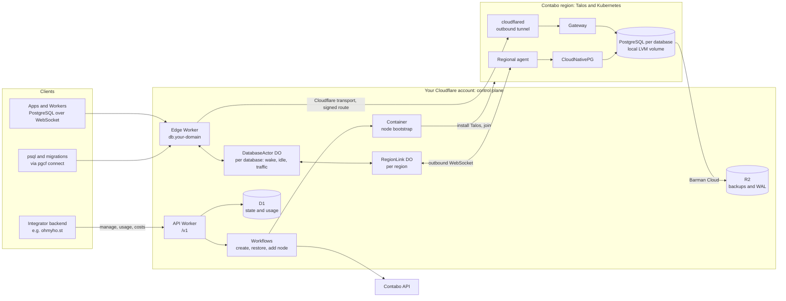
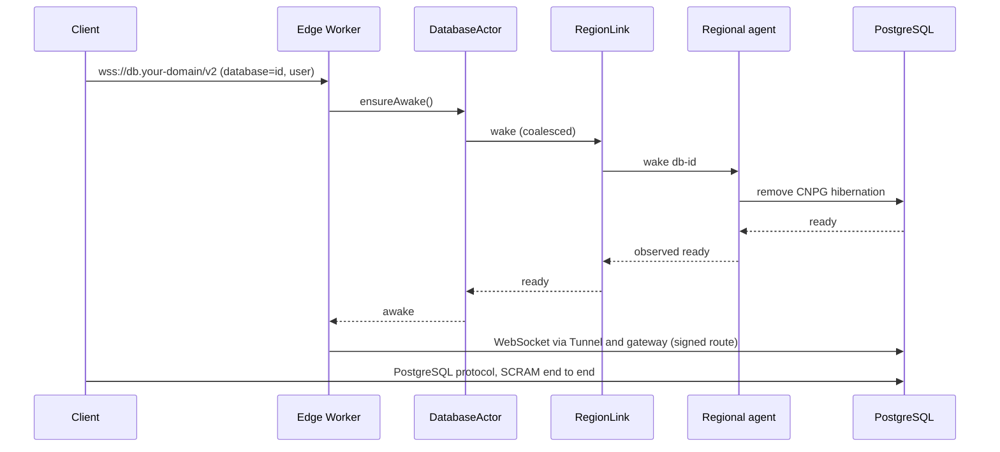

# cloudflare-postgres

Open-source, Neon-style serverless PostgreSQL that runs on **your Cloudflare account** and **your
Contabo VPS**. Cloudflare runs the whole control plane and is the only way into the databases.
The VPS run real, unmodified PostgreSQL under CloudNativePG.

- Create, resize, suspend, restore and delete databases through a versioned API.
- Connect through Cloudflare: PostgreSQL over WebSocket. The VPS expose no database port.
- Databases sleep when idle and wake on the next connection.
- Continuous backups to R2 with point-in-time recovery.
- Usage and infrastructure-cost metrics per database. You put your own pricing on top.
- Horizontal scaling: Cloudflare adds Contabo VPS through the Contabo API within your caps.

[ohmyho.st](https://ohmyho.st) is the first adopter. It replaces Neon with this service.

## Status

**Reset on 2026-10-02.** A lean design (below) replaces the first implementation. The working
Talos, Flux platform and R2 backup/PITR recipes in [infra/](infra/README.md) are kept. The
services described here are being built; see [PLAN.md](PLAN.md) for phases and status.

## Architecture

Connecting to a sleeping database (sleep and wake arrive in Phase 2; in Phase 1 databases always run):

| Part | Where | Job |
| --- | --- | --- |
| API Worker | Cloudflare | `/v1` API, D1 state, Durable Objects, Workflows, usage rollups |
| Edge Worker | Cloudflare | Database endpoint: wake, route, count traffic |
| Regional agent | Kubernetes | Reconciles databases into CNPG resources; hibernate/wake; reports status and samples |
| Gateway + cloudflared | Kubernetes | Only entry from Cloudflare to PostgreSQL |
| Node bootstrap | Cloudflare Container | Turns a Contabo VPS into a Talos node |
| Platform | Kubernetes (Flux) | Cilium, OpenEBS LocalPV LVM, cert-manager, CloudNativePG, Barman Cloud plugin |

## Self-hosting requirements

- A Cloudflare account on the Workers Paid plan, with a zone that hosts one endpoint hostname
  (`db.your-domain`): Workers, D1, Durable Objects, Workflows, R2, Tunnel and Containers.
- A Contabo account with API credentials. The lab uses Cloud VPS with 4 vCPU and 8 GiB.

An install path is part of the open-source release phase in [PLAN.md](PLAN.md#phase-5--open-source-release).

## Documents

- [PLAN.md](PLAN.md): scope, architecture, phases, decisions and status.
- [AGENTS.md](AGENTS.md): contributor and coding-agent brief.
- [THIRD_PARTY.md](THIRD_PARTY.md): upstream components and licenses.
- [infra/](infra/README.md): Talos, platform and backup recipes.

## License

Original code and documentation: [Apache License 2.0](LICENSE). Third-party components keep their
own licenses. This is an independent project, not affiliated with Cloudflare, Contabo, Neon,
Supabase or CloudNativePG.
