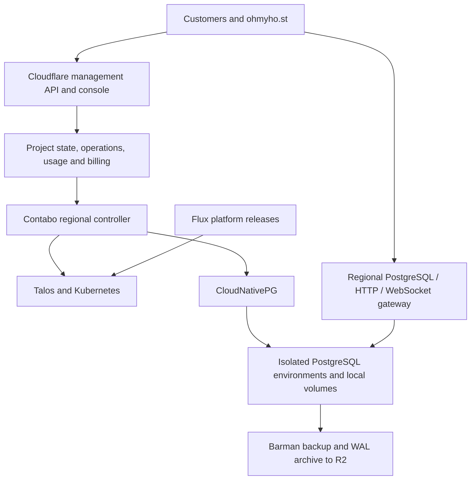

# cloudflare-postgres

An independent, open-source PostgreSQL platform with a Cloudflare management layer and self-operated PostgreSQL infrastructure on Contabo.

The planned product combines existing open-source database and operations tools into a self-hostable platform and a hosted SaaS service. [ohmyho.st](https://ohmyho.st) is the first intended customer and migration acceptance case.

## Development status

**Repository foundation only.** This repository currently contains the approved high-level plan, project guidance, and licensing information. It does not yet contain a working database platform, deployment automation, or a production service. Candidate components have not been integrated or validated together.

Implementation starts with three feasibility checks: unattended Talos bootstrap on Contabo, a Neon proxy adapter for ordinary CloudNativePG PostgreSQL, and complete backup/WAL/PITR recovery from Cloudflare R2.

## Planned architecture

CloudNativePG manages PostgreSQL lifecycle and replication. Talos provides the declarative server foundation; Flux manages platform components. The product supplies customer management, policy, orchestration, usage accounting, and integration between these components.

Native PostgreSQL connections terminate at regional gateways. HTTPS and WebSocket access can use Cloudflare routing; ordinary Workers HTTP ingress is not a native PostgreSQL listener. Regional database operations are intended to continue under the last validated configuration during management-plane outages.

## Version-one scope

- Organizations, projects, databases, roles, credentials, and regional placement.
- Native PostgreSQL, connection pooling, and interactive transactions.
- Usage attribution, versioned pricing, budgets, and hosted billing.
- Automatic sleep/wake, manual resizing, and bounded autoscaling.
- Physical backups, WAL archiving, and tested point-in-time recovery.
- Automated maintenance, tenant isolation, monitoring, and recovery procedures.

Short reconnects during resizing are accepted. Database branching is deferred until after the initial production release. Supabase Auth, Storage, Realtime, and Functions are outside the approved database scope.

## Project documents

- [PLAN.md](PLAN.md): approved direction, component reuse, responsibilities, delivery milestones, and acceptance gates.
- [AGENTS.md](AGENTS.md): the 25-line project brief for contributors and coding agents.
- [THIRD_PARTY.md](THIRD_PARTY.md): upstream candidates, licenses, integration decisions, and provenance requirements.

## License and independence

Original project code and documentation are licensed under [Apache License 2.0](LICENSE). Third-party components retain their own licenses and notices; none are bundled in this initial documentation-only repository.

This is an independent project, not an official product of or affiliated with Cloudflare, Contabo, Neon, Supabase, or the CloudNativePG project. Product and project names identify the technologies being evaluated and remain the property of their respective owners.
