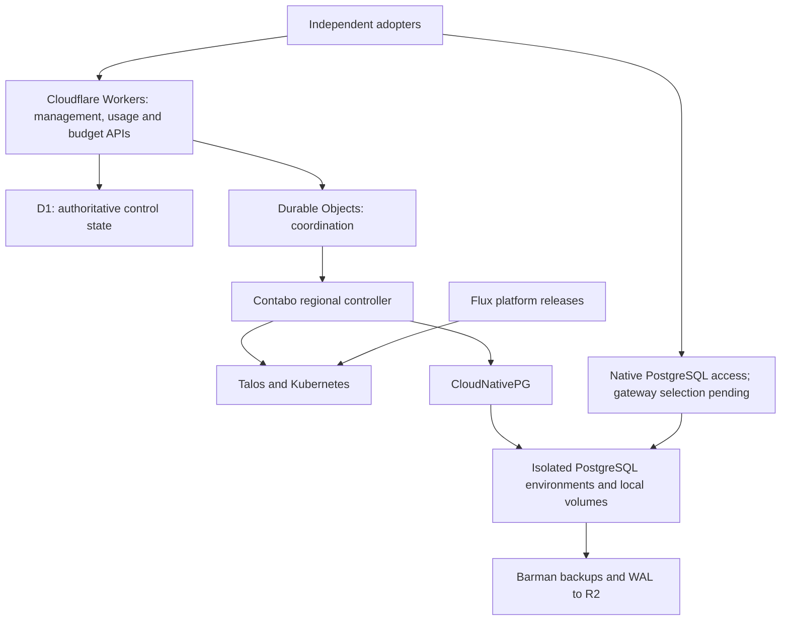

# cloudflare-postgres

An independent, open-source PostgreSQL platform with a Cloudflare management layer and self-operated PostgreSQL infrastructure on Contabo.

**Open source first.** The initial product gives adopters management APIs, database operations, usage reporting, and API-controlled budgets. Hosted SaaS and reselling come later. [ohmyho.st](https://ohmyho.st) is our first adopter and integration customer.

## Development status

**Early development.** The deployed [control API](apps/control-api/README.md) provides organization bootstrap, recovery listing, scoped regions, global logical projects, immutable catalogs, explicit admission, environment intents and leased execution. No catalog or API-managed environment has been created; lab admission is closed. An active logical project or controller-ready result supplies no customer database endpoint or credentials.

The [regional usage collector checkpoint](docs/evidence/m3-regional-usage-collector-2026-09-28.md) now verifies the running Dev controller, authenticated execution/meter clients, an empty owned inventory, and its persistent private journal across one Pod replacement under the pinned Node image. Local verification used exactly three new Node cases and one broad gate, followed by a targeted startup-test path correction recorded in the evidence. The manual M1 database is excluded from this collector. Positive managed usage, complete/final accounting and API-to-CNPG qualification remain open. Local Talos image import is a lab path; anonymous GHCR pulling and public release distribution are pending.

The [usage and budget authority checkpoint](docs/evidence/m3-usage-budget-authority-2026-09-28.md) supplies deployed exact revisions, fixed-snapshot exports, purpose-specific credentials, scoped policies and fenced allowance accounting. Live checks verified unknown empty coverage, credential boundaries, exact grants, conditional updates and requested pause/resume. Positive usage ingestion, receipt encryption/replay, settlement and PostgreSQL stop behavior remain unverified live. Budgets report `runtimeEnforced: false` and `enforcementStatus: pending_runtime`; the provisional collector does not enforce them. This does not complete M3 or M6.

The [M1 lab checkpoint](docs/evidence/m1-2026-09-28.md) verifies Talos, Kubernetes, Cilium, bounded local volumes, and one manually created PostgreSQL instance on a disposable Contabo node. SQL transactions and a node-restart readback passed. Public [Talos bootstrap assets](infra/talos/README.md) and a [pinned Flux platform baseline](infra/platform/README.md) package the installation configuration. The manual lab database was not provisioned by the management API.

The [initial M4 adoption checkpoint](docs/evidence/m4-platform-adoption-2026-09-28.md) verifies Cilium/OpenEBS ownership and restoration of a nonsemantic ConfigMap drift. The [cert-manager checkpoint](docs/evidence/m4-cert-manager-adoption-2026-09-28.md) verifies its guarded same-version handoff. The [CNPG checkpoint](docs/evidence/m4-cnpg-adoption-2026-09-28.md) now verifies 19 guarded ownership patches and one activation of the unchanged `1.30.1` operator through its compatibility overlay. The release and operator Deployment are current-generation Ready; webhook admission, CA content/ownership, PostgreSQL Pod identities/restart counts, SQL markers and node health are preserved. Four platform releases are active; Barman remains suspended and manually installed. Automated provider bootstrap, host maintenance, staged upgrades, recovery, gateway, and production qualification remain open; M4 is incomplete.

The [Barman preflight checkpoint](docs/evidence/m4-barman-preflight-2026-09-28.md) records the prepared compatibility assets and an actual SSA rejection when switching the sidecar-image reference. The bounded workflow stopped after two observation corrections. An explicit field migration is prepared privately and awaits a one-attempt exception; the active overlay is not qualified for promotion.

The [platform inspection checkpoint](docs/evidence/m4-platform-inspection-2026-09-28.md) adds a reusable read-only CLI with redacted JSON, complete bounded lists, current-generation/version/source checks and explicit unverified operational gates. Three new integration cases failed first; one frozen full gate passed all 22 cases. Live inspection correctly reports four Ready releases and suspended Barman. It does not authorize maintenance or qualify database recovery.

The first implementation steps are infrastructure/recovery proofs and an early generic pilot using one always-on database over native PostgreSQL. Adopter-specific adapters and migration TODOs belong in their own repositories. Gateway selection follows technical and maintenance evaluation. Sleep/wake and bounded automatic compute scaling remain v1 requirements after that baseline.

The [allocation continuity checkpoint](docs/evidence/m3-allocation-continuity-2026-09-28.md) preserves provisional resource-time through normal observation changes and retained storage. The updated Dev collector has verified public compiled code and journal preservation; positive managed usage, complete/final accounting and runtime budget enforcement remain open.

The [maintenance preparation checkpoint](docs/evidence/m4-maintenance-preparation-2026-09-28.md) adds installation-owned immutable plans, separate preparer credentials, fenced leases and durable regional assessments. The Dev API/migration and compiled CLI persist the real lab's missing prerequisites as blockers. Preparation never grants execution authority; host updates, recovery and production qualification remain incomplete.

## Self-hosting model

Adopters need their own Cloudflare account for the management deployment, authoritative control state, secrets, and R2 archives, plus Contabo infrastructure for PostgreSQL. This is not a Cloudflare-independent deployment. Initial [infrastructure](infra/README.md) and controller setup recipes are published; a complete, independently verified installation procedure remains a release gate.

The selected control-state mapping uses Workers for APIs, D1 for canonical management/usage/budget data, Durable Objects for coordination, and R2 for large artifacts. The current development implementation supplies conditional execution leases and D1-backed usage/budget authority. Durable Object coordination, complete/final regional usage, journal node-loss recovery, runtime enforcement, and control-state recovery remain pending.

## Planned architecture

CloudNativePG manages PostgreSQL lifecycle and replication. Talos provides the declarative server foundation; Flux manages platform components. The product supplies project management, usage reporting, budget enforcement, policy, and orchestration between those components.

Native PostgreSQL uses regional TCP endpoints. Ordinary Workers HTTP ingress is not a PostgreSQL listener. Gateway failover, pooling ownership, and regional operation during Cloudflare outages require explicit acceptance evidence.

## Initial scope

- Organizations, projects, databases, roles, credentials, and regional placement through versioned APIs.
- Native PostgreSQL, connection pooling, and interactive transactions.
- Attributable usage reporting, machine-readable exports, and API-controlled budgets with enforcement.
- Automatic sleep/wake, manual resizing, and bounded automatic compute scaling.
- Physical backups, WAL archiving, point-in-time recovery, retention, and safe deletion.
- Repeatable maintenance, tenant isolation, monitoring, and recovery procedures.

Budget APIs remain in v1; payment processing, subscriptions, invoicing, and a retail pricing catalog are deferred with the hosted offering. Each integrator retains its own aggregate wallet and customer billing and assigns the database allowance through the same generic API.

Short reconnects during resizing are accepted. Branching is deferred. Supabase Auth, Storage, Realtime, and Functions remain outside scope. HTTP/WebSocket access, PostgREST, postgres-meta, and a Studio-derived workbench are optional follow-on integrations after the native pilot.

## Development discipline

Use the [bounded TDD policy](PLAN.md#10-bounded-tdd-and-verification-discipline): at most three new or expanded top-level tests per fix, each red first; targeted test files during iteration; one final full gate; and mandatory stop/report limits. Do not generate test matrices or speculative suites. Consumer-specific defaults, adapters, and compatibility TODOs belong in consumer repositories.

## Project documents

- [PLAN.md](PLAN.md): canonical scope, assumptions, architecture, delivery sequence, and acceptance gates.
- [AGENTS.md](AGENTS.md): the 25-line contributor and coding-agent brief.
- [THIRD_PARTY.md](THIRD_PARTY.md): upstream candidates, licenses, integration decisions, and provenance requirements.

## License and independence

Original project code and documentation are licensed under [Apache License 2.0](LICENSE). Third-party components retain their own licenses and notices; evaluated upstream projects have not been vendored into this repository.

This is an independent project, not an official product of or affiliated with Cloudflare, Contabo, Neon, Supabase, or the CloudNativePG project. Product and project names identify the technologies being evaluated and remain the property of their respective owners.

The [prepared telemetry configuration](infra/telemetry/README.md) reuses maintained Prometheus components with pinned chart/images and bounded lab resources. Its release remains suspended and unapplied pending network and runtime qualification; [evidence](docs/evidence/m4-telemetry-preparation-2026-09-28.md) distinguishes preparation from live behavior.
