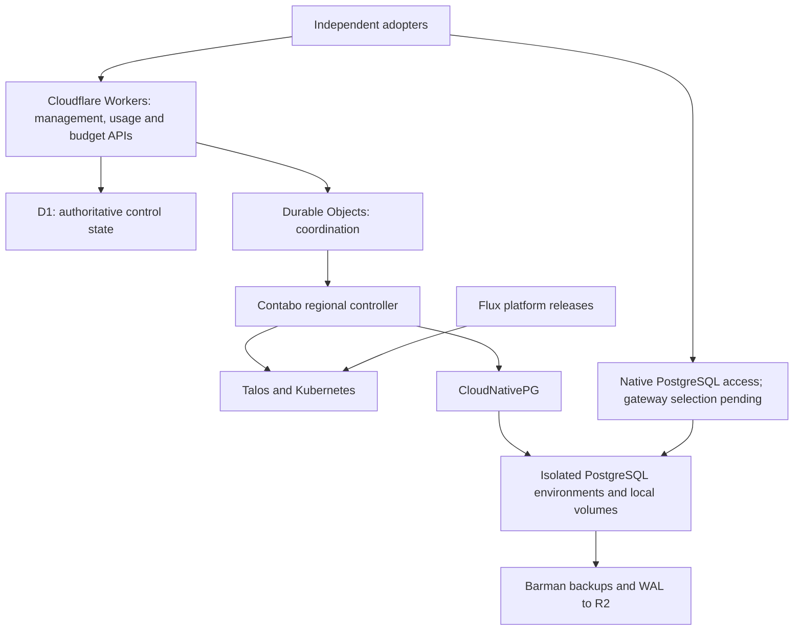

# cloudflare-postgres

An independent, open-source PostgreSQL platform with a Cloudflare management layer and self-operated PostgreSQL infrastructure on Contabo.

**Open source first.** The initial product gives adopters management APIs, database operations, usage reporting, and API-controlled budgets. Hosted SaaS and reselling come later. [ohmyho.st](https://ohmyho.st) is our first adopter and integration customer.

## Development status

**Early development.** The [control API first slice](apps/control-api/README.md) is deployed to a development Worker. It implements authenticated organization bootstrap, paginated recovery listing, region registration with scoped tokens, and D1-backed project intent with a queued operation. The [M1 lab checkpoint](docs/evidence/m1-2026-09-28.md) verifies Talos, Kubernetes, Cilium, bounded local volumes, and one manually created PostgreSQL instance on a disposable Contabo node. SQL transactions and a node-restart readback passed. The management API does not provision this database; the regional controller, gateway, backup/restore path, and production service remain unimplemented.

The first implementation steps are infrastructure/recovery proofs and an early generic pilot using one always-on database over native PostgreSQL. Adopter-specific adapters and migration TODOs belong in their own repositories. Gateway selection follows technical and maintenance evaluation. Sleep/wake and bounded automatic compute scaling remain v1 requirements after that baseline.

## Self-hosting model

Adopters need their own Cloudflare account for the management deployment, authoritative control state, secrets, and R2 archives, plus Contabo infrastructure for PostgreSQL. This is not a Cloudflare-independent deployment. There is no installation procedure yet.

The planned control-state mapping uses Workers for APIs, D1 for canonical management/usage/budget data, Durable Objects for coordination, and R2 for large artifacts. Regional controllers retain authorized operational copies and bounded usage buffers for degraded operation. This mapping still needs implementation and recovery validation.

## Planned architecture

CloudNativePG manages PostgreSQL lifecycle and replication. Talos provides the declarative server foundation; Flux manages platform components. The product supplies project management, usage reporting, budget enforcement, policy, and orchestration between those components.

Native PostgreSQL uses regional TCP endpoints. Ordinary Workers HTTP ingress is not a PostgreSQL listener. Gateway failover, pooling ownership, and regional operation during Cloudflare outages require explicit acceptance evidence.

## Initial scope

- Organizations, projects, databases, roles, credentials, and regional placement through versioned APIs.
- Native PostgreSQL, connection pooling, and interactive transactions.
- Attributable usage reporting, machine-readable exports, and API-controlled budgets with enforcement.
- Automatic sleep/wake, manual resizing, and bounded automatic compute scaling.
- Physical backups, WAL archiving, point-in-time recovery, retention, and safe deletion.
- Repeatable maintenance, tenant isolation, monitoring, and recovery procedures.

Budget APIs remain in v1; payment processing, subscriptions, invoicing, and a retail pricing catalog are deferred with the hosted offering. Each integrator retains its own aggregate wallet and customer billing and assigns the database allowance through the same generic API.

Short reconnects during resizing are accepted. Branching is deferred. Supabase Auth, Storage, Realtime, and Functions remain outside scope. HTTP/WebSocket access, PostgREST, postgres-meta, and a Studio-derived workbench are optional follow-on integrations after the native pilot.

## Development discipline

Use the [bounded TDD policy](PLAN.md#10-bounded-tdd-and-verification-discipline): at most three new or expanded top-level tests per fix, each red first; targeted test files during iteration; one final full gate; and mandatory stop/report limits. Do not generate test matrices or speculative suites. Consumer-specific defaults, adapters, and compatibility TODOs belong in consumer repositories.

## Project documents

- [PLAN.md](PLAN.md): canonical scope, assumptions, architecture, delivery sequence, and acceptance gates.
- [AGENTS.md](AGENTS.md): the 25-line contributor and coding-agent brief.
- [THIRD_PARTY.md](THIRD_PARTY.md): upstream candidates, licenses, integration decisions, and provenance requirements.

## License and independence

Original project code and documentation are licensed under [Apache License 2.0](LICENSE). Third-party components retain their own licenses and notices; evaluated upstream projects have not been vendored into this repository.

This is an independent project, not an official product of or affiliated with Cloudflare, Contabo, Neon, Supabase, or the CloudNativePG project. Product and project names identify the technologies being evaluated and remain the property of their respective owners.
