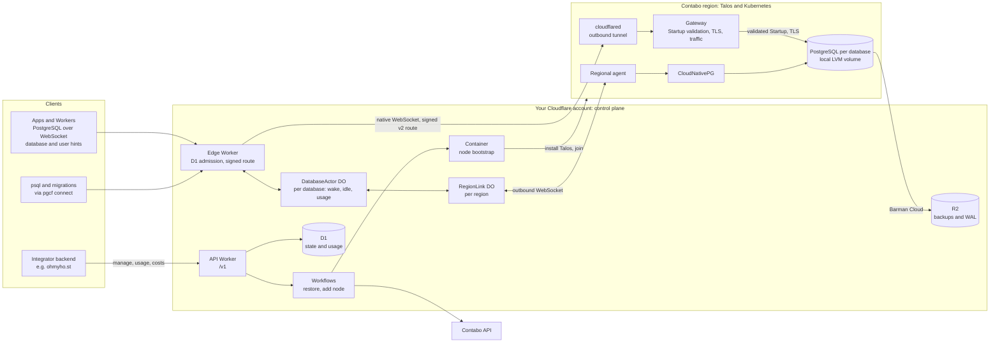

# cloudflare-postgres

Open-source, Neon-style serverless PostgreSQL that runs on **your Cloudflare account** and **your
Contabo VPS**. Cloudflare runs the whole control plane and is the only way into the databases.
The VPS run real, unmodified PostgreSQL under CloudNativePG. The planned initial deployment uses two EU
VPS (one control-plane/worker and one worker) and one US control-plane/worker VPS. Customer
databases run on all three nodes with resources reserved for the system and platform; server
loss is recovered from R2.

- Create, resize, suspend, restore and delete databases through a versioned API.
- Connect through Cloudflare: PostgreSQL over WebSocket. The VPS expose no database port.
- Databases sleep when idle and wake on the next connection.
- Continuous backups to R2 with point-in-time recovery.
- Usage and infrastructure-cost metrics per database. You put your own pricing on top.
- Horizontal scaling: Cloudflare adds Contabo VPS through the Contabo API within your caps.

[ohmyho.st](https://ohmyho.st) is the first adopter. It will replace Neon with this service.

## Status

**Phases 0 and 1 accepted in Dev; Phase 2 in progress (2026-10-04).** The first EU node and
all five Flux releases are Ready, with 95 GiB storage. The complete Dev path through
`db.ohmyho.st` reaches real PostgreSQL with verified TLS, continuous WAL archiving and R2 backups.

Real E0–E6 passed, including complete TCP port scans of the observed node IPv4 from both sources.
Five create/delete runs survived ten agent restarts with complete storage cleanup. Empty, failed,
stale and out-of-order desired-state responses preserved storage and configuration generations.
Loss of a ready database namespace reported recovery required rather than creating empty storage.
The R2 outage test proved two failing archive observations under the active block and a successful
new connection during the alarm. A separate restore drill preserved committed markers, omitted
a rolled-back marker and reclaimed its target storage; full PITR and disaster recovery remain pending.

Raw 100 MiB and 1 GiB stream checks, slow reception and 600 seconds idle passed. A 10-second
read load measured 735.604 SQL/s over 50 warmed connections, p95 75.368 ms and zero errors.
These observations do not establish maximum throughput or 1,000-customer capacity. Random routing
hints can still amplify D1 reads. Default-text clients and raw COPY pass; decoded binary-result
assertions remain failed on WebSocket and direct TCP with node-postgres 8.22. Intermittent Tail
correlation remains unresolved.

The installable CLI passed real psql transactions, rollback and 105 MB binary COPY integrity.
CPU placement and sleep-safety work are underway; hibernation, wake, usage and costs remain pending.
The second EU node is untouched, the US node has not been bought and no customer or platform
database has been migrated. Image signing and the complete production-ready release remain pending.
See [PLAN.md](PLAN.md#11-status) for measured results and remaining work.

## Architecture



Connecting to a sleeping database (sleep and wake arrive in Phase 2; in Phase 1 databases always run):

```mermaid
sequenceDiagram
  participant C as Client
  participant E as Edge Worker
  participant A as DatabaseActor
  participant R as RegionLink
  participant G as Regional agent
  participant P as PostgreSQL

  C->>E: GET /v2?database=id&user=role (untrusted hints)
  E->>A: ensureAwake()
  A->>R: wake (coalesced)
  R->>G: wake db-id
  G->>P: remove CNPG hibernation
  P-->>G: ready
  G-->>R: observed ready
  R-->>A: ready
  A-->>E: awake
  E->>P: native WebSocket via Tunnel and gateway (signed v2 route)
  C->>P: gateway validates Startup; PostgreSQL SCRAM end to end
```

| Part                  | Where                | Job                                                                                  |
| --------------------- | -------------------- | ------------------------------------------------------------------------------------ |
| API Worker            | Cloudflare           | `/v1` API, D1 state, Durable Objects, Workflows, usage rollups                       |
| Edge Worker           | Cloudflare           | Database endpoint: D1 admission, wake, signed route, native forwarding |
| Regional agent        | Kubernetes           | Reconciles databases into CNPG resources; hibernate/wake; reports status and samples |
| Gateway + cloudflared | Kubernetes           | Entry from Cloudflare; startup validation before PostgreSQL dial, TLS, stream counters |
| Node bootstrap        | Cloudflare Container | Turns a Contabo VPS into a Talos node                                                |
| Platform              | Kubernetes (Flux)    | Cilium, OpenEBS LocalPV LVM, cert-manager, CloudNativePG, Barman Cloud plugin        |

The approved client endpoint is `GET /v2?database=<id>&user=<role>` on the single database hostname.
Configure the Neon serverless driver's `Pool`/`Client` WebSocket mode with `pipelineConnect=false`
and a `wsProxy` URL containing both URL-encoded hints. Requests to the bare `/v2` endpoint or with
missing or invalid hints are unsupported. Edge checks the database and role against D1, signs a
v2 routing token with mandatory user, and returns the unopened upstream WebSocket for native
forwarding. Admission failures return a small failure-only `101` WebSocket carrying a PostgreSQL
SQLSTATE error before any gateway upgrade or PostgreSQL dial. Dev uses a VPC HTTP service with
native forwarding; VPC TCP raw streams were unsuitable, and a signed Tunnel route is the fallback.

The gateway checks the actual PostgreSQL StartupMessage database and user against the signed
route before opening PostgreSQL. It owns SSL/GSS preludes, CancelRequest, startup parsing and the
startup deadline, negotiates verified TLS to PostgreSQL, and measures stream bytes and connection
events. SCRAM authentication runs end to end with PostgreSQL; uncertain writes are never replayed.

### PostgreSQL tools

Build the CLI from this checkout with `pnpm --filter @pgcf/cli build`, then run:

```sh
node packages/cli/dist/main.js connect --endpoint wss://db.your-domain --database <db-id> --user app
```

Use the printed loopback port in psql or migration tools, with `host=127.0.0.1`, your database
and user, and `sslmode=disable`. Enter the password in the PostgreSQL tool. The local hop is
plaintext; the public hop uses verified WSS and the gateway verifies PostgreSQL TLS. The CLI
adapts only the SASL mechanism offer to plain SCRAM for libpq compatibility; channel binding
requiring direct PostgreSQL TLS is unsupported. It never retries SQL. Limits are 16 local
connections, 1 MiB per WebSocket message and a bounded 10-second FIN grace (at most 20 seconds
during upstream startup). The packaged CLI includes the first-party and bundled-library licenses.

## Self-hosting requirements

- A Cloudflare account on the Workers Paid plan, with a zone that hosts one endpoint hostname
  (`db.your-domain`): Workers, D1, Durable Objects, Workflows, R2, Tunnel and Containers.
- A Contabo account with API credentials. The lab uses Cloud VPS with 4 vCPU and 8 GiB.

An install path is part of the open-source release phase in [PLAN.md](PLAN.md#phase-5--open-source-release).

## Documents

- [PLAN.md](PLAN.md): scope, architecture, phases, decisions and status.
- [AGENTS.md](AGENTS.md): contributor and coding-agent brief.
- [THIRD_PARTY.md](THIRD_PARTY.md): upstream components and licenses.
- [infra/](infra/README.md): Talos, platform and backup recipes.
- [Native external probe](docs/operations/native-external-probe.md): the supplemental Dev TCP/25
  check for Phase 1 network isolation, including provenance verification and cleanup.

## License

Original code and documentation: [Apache License 2.0](LICENSE). Third-party components keep their
own licenses. This is an independent project, not affiliated with Cloudflare, Contabo, Neon,
Supabase or CloudNativePG.
