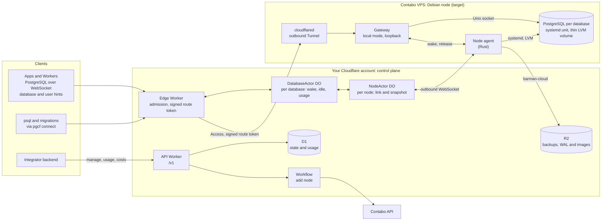

# cloudflare-postgres

Open-source, Neon-style serverless PostgreSQL that runs on **your Cloudflare account** and **your
Contabo VPS**. Cloudflare runs the whole control plane and is the only way into the databases.
Each VPS is a self-contained Debian node: real, unmodified PostgreSQL runs as one sandboxed
systemd service per database on its own thin LVM volume, next to one Rust node agent. There is
no Kubernetes and no control server. That node runtime is being built per the ULTRA plan. The
deployment is EU only, with the customer node **EU1**, a Contabo Cloud VPS with **6 vCPU and
12 GB RAM**. Server loss is recovered from R2.

- Create, resize, suspend, restore and delete databases through a versioned API.
- Connect through Cloudflare: PostgreSQL over WebSocket. The VPS expose no database port.
- Databases sleep when idle and wake on the next connection.
- Continuous backups to R2 with point-in-time recovery.
- Usage and infrastructure-cost metrics per database. You put your own pricing on top.
- Capacity placement and Contabo purchases are implemented and stay off until the operator enables them; node installation is being rebuilt as a pull installer ([plan 9.2](docs/architecture/cloudflare-convergence-and-serverless-plan.md#92-installing-a-node-on-contabo-no-relay-no-ssh)).

Integrators keep their adapters and any tooling that moves their existing databases in their own
repositories; the [integrator handover](docs/operations/integrator-handover.md) describes the API,
connections and limits they build on.

## Status

The [ULTRA plan](docs/architecture/cloudflare-convergence-and-serverless-plan.md) is the canonical
record of scope, measured results ([Done](docs/architecture/cloudflare-convergence-and-serverless-plan.md#111-done)),
the [go-live gates](docs/architecture/cloudflare-convergence-and-serverless-plan.md#stage-7-go-live-gates) and
what is [not in v1](docs/architecture/cloudflare-convergence-and-serverless-plan.md#111-not-in-v1).
The first integrator creates its new databases on PGCF once that path is complete. This README
states what runs where; it does not repeat measurements.

| Part                                             | State                                                                                                                    |
| ------------------------------------------------ | ------------------------------------------------------------------------------------------------------------------------ |
| API Worker, DatabaseActor, NodeActor, Workflows  | TypeScript on Cloudflare; the node link (NodeActor, `/node/v1`) is built in Stage 3 and not deployed; the rest remains TypeScript |
| Edge Worker                                      | TypeScript (`apps/edge`) is deployed; the Rust/Wasm target (`apps/edge-rust`) is built by CI and not deployed            |
| Gateway                                          | Rust (`apps/native-gateway`): beside the node agent, on its table and the databases' Unix sockets; not deployed          |
| Node runtime                                     | Not running: the Kubernetes runtime was retired on 2026-10-17; the node agent and the node image are built in Stage 3    |

The actual-RAM expansion threshold and automatic-purchase switch are operator settings exposed
through the authenticated management API. Expansion requires ten fresh aligned consecutive
minutes from every eligible customer node, each retaining its own Node UID. Existing capacity
remains eligible during rollout under hard RAM, CPU, storage and full PostgreSQL/Barman
startup-peak guards; there is no 81% placement cutoff. Missing observations remain unknown. Fresh
installations do not purchase automatically or send notifications, and this installation keeps
purchases and autoscale off. An optional `max_nodes` limit can be removed with `null`; no fixed
three-node ceiling is required. Monetary and lifetime order-count ceilings are optional under
explicit operator authority.

## Architecture

The diagram shows the target of the
[ULTRA plan](docs/architecture/cloudflare-convergence-and-serverless-plan.md#51-big-picture);
the node side is built in Stage 3.


```mermaid
flowchart LR
  subgraph Clients
    App["Apps and Workers<br/>PostgreSQL over WebSocket<br/>database and user hints"]
    Tools["psql and migrations<br/>via pgcf connect"]
    Integrator["Integrator backend"]
  end

  subgraph CF["Your Cloudflare account: control plane"]
    Edge["Edge Worker<br/>admission, signed route token"]
    API["API Worker<br/>/v1"]
    DBA["DatabaseActor DO<br/>per database: wake, idle, usage"]
    NA["NodeActor DO<br/>per node: link and snapshot"]
    WF["Workflow<br/>add node"]
    D1[("D1<br/>state and usage")]
    R2[("R2<br/>backups, WAL and images")]
  end

  subgraph Node["Contabo VPS: Debian node (target)"]
    CFD["cloudflared<br/>outbound Tunnel"]
    GW["Gateway<br/>local mode, loopback"]
    Agent["Node agent<br/>(Rust)"]
    PG[("PostgreSQL per database<br/>systemd unit, thin LVM volume")]
  end

  Contabo["Contabo API"]

  App --> Edge
  Tools --> Edge
  Integrator -->|"manage, usage, costs"| API
  Edge <--> DBA
  Edge -->|"Access, signed route token"| CFD
  CFD --> GW
  GW -->|"Unix socket"| PG
  GW <-->|"wake, release"| Agent
  API --> D1
  API --> WF
  DBA <--> NA
  NA <-->|"outbound WebSocket"| Agent
  Agent -->|"systemd, LVM"| PG
  Agent -->|"barman-cloud"| R2
  WF --> Contabo
```

Connecting to a sleeping database follows the
[cold wake steps](docs/architecture/cloudflare-convergence-and-serverless-plan.md#59-a-cold-wake-step-by-step) of the ULTRA plan.

| Part                  | Where      | Job                                                                                                         |
| --------------------- | ---------- | ----------------------------------------------------------------------------------------------------------- |
| API Worker            | Cloudflare | `/v1` API, D1 state, Durable Objects, Workflows, usage rollups                                              |
| Edge Worker           | Cloudflare | Database endpoint: Actor admission, wake, signed route, native forwarding                                   |
| Gateway + cloudflared | VPS        | Native Rust gateway: entry from Cloudflare; startup validation before PostgreSQL dial, stream counters      |
| Node agent            | VPS        | Rust, built in Stage 3: admission, volumes, systemd units, backups and recovery; the only actor on the node |

The approved client endpoint is `GET /v2?database=<id>&user=<role>` on the single database hostname.
Configure the Neon serverless driver's `Pool`/`Client` WebSocket mode with its default
`pipelineConnect: "password"` and a `wsProxy` URL containing both URL-encoded hints. Requests to
the bare `/v2` endpoint or with missing or invalid hints are unsupported. Actor admission checks the database and role against D1.
The Edge signs a route token that lives 30 seconds and names the database, role, region, database
generation and verified primary Pod (v3; v4 adds the admission route revision), and returns the
unopened upstream WebSocket for native forwarding. Admission failures return a small failure-only
`101` WebSocket carrying a PostgreSQL SQLSTATE error before any gateway upgrade or PostgreSQL dial.
Dev uses a VPC HTTP service with native forwarding; VPC TCP raw streams were unsuitable, and a
signed Tunnel route is the fallback.

The gateway checks the actual PostgreSQL StartupMessage database and user against the signed
route before opening PostgreSQL. It owns SSL/GSS preludes, CancelRequest, startup parsing and the
startup deadline, negotiates verified TLS to PostgreSQL, and measures stream bytes and connection
events. A client that pipelines its password in the message of its StartupMessage (the Neon
driver's default) is asked for it with AuthenticationCleartextPassword over the encrypted
WebSocket; the gateway then logs in to PostgreSQL with SCRAM-SHA-256 on the node, trusts
PostgreSQL only after its server signature, and never logs or stores the password. Any other
client, such as the CLI, authenticates with SCRAM end to end with PostgreSQL. Uncertain writes are
never replayed.

### PostgreSQL tools

Build the CLI from this checkout with `pnpm --filter @pgcf/cli build`, then run:

```sh
node packages/cli/dist/main.js connect --endpoint wss://db.example.com --database <db-id> --user app
```

Use the printed loopback port in psql or migration tools, with `host=127.0.0.1`, your database
and user, and `sslmode=disable`. Enter the password in the PostgreSQL tool. The local hop is
plaintext; the public hop uses verified WSS and the gateway verifies PostgreSQL TLS. The CLI
adapts only the SASL mechanism offer to plain SCRAM for libpq compatibility; channel binding
requiring direct PostgreSQL TLS is unsupported. It never retries SQL. Limits are 16 local
connections, 1 MiB per WebSocket message and a bounded 10-second FIN grace (at most 20 seconds
during upstream startup). The packaged CLI includes the first-party and bundled-library licenses.

## Self-hosting requirements

- A Cloudflare account on the Workers Paid plan, with a zone that hosts one endpoint hostname
  (`db.example.com`): Workers, D1, Durable Objects, Workflows, R2, Tunnel and Access.
- A Contabo account with API credentials. EU1 is a Cloud VPS with 6 vCPU and 12 GB RAM.

The current target is the operator deployment on existing accounts with the customer node EU1.
Further nodes and regions use the same node image; see the
[delivery stages](docs/architecture/cloudflare-convergence-and-serverless-plan.md#10-delivery-stages).
Public-release installation polish follows separately; see [not in v1](docs/architecture/cloudflare-convergence-and-serverless-plan.md#111-not-in-v1) in the ULTRA plan.

The management API reference is generated at `/v1/openapi.json` from the shared contracts.
Node operations are published at `/node/v1/openapi.json`. Each document contains only its
interface and referenced schemas.
Their `info.version` is the request-serving Worker's version ID; `info.x-worker-version` also
includes its tag and timestamp. Configure the `CF_VERSION_METADATA` version metadata binding
shown in the example Worker configuration. If it is missing, reference requests return an
explicit internal error rather than a made-up version. Operator runbooks
cover [installation](docs/operations/operator-installation.md), [recovery](docs/operations/recovery.md)
and [credential changes](docs/operations/credentials.md).

The small TypeScript management client uses these same request and response contracts:

```ts
import { PgcfClient } from "@pgcf/contracts/client";

const client = new PgcfClient({
  baseUrl: process.env.PGCF_API_URL!,
  apiKey: process.env.PGCF_API_KEY!,
});
const restored = await client.restoreDatabase(sourceId,
  { mode: "full", name: "recovered" }, logicalOperationKey);
```

Keep `logicalOperationKey` stable for retries of that management operation. The client does not
retry uncertain writes or expose server response bodies in errors. PostgreSQL client pooling
remains the integrator's responsibility.

### Optional infrastructure notifications

Warnings are disabled by default. Use authenticated
`PUT /v1/regions/{region_id}/capacity-policy` to set `ram_warning_threshold_ppm` to the desired
parts-per-million RAM threshold (for example, `800000` means 80%). Set it to `null` to disable
RAM warnings. A cap notice additionally requires both a finite `max_nodes` and
`cap_warning_enabled: true`; set the flag to `false` to disable it. RAM warnings use the same
fresh, complete ten-minute regional measurements as capacity decisions.

Per-node warnings use the same route and scale: `node_ram_warning_threshold_ppm`,
`node_cpu_warning_threshold_ppm` and `node_storage_warning_threshold_ppm` each take an integer
from `1` to `1000000` parts per million (`900000` means 90%). `null` disables a warning; omitting
a field keeps its stored value. A warning fires when any single node reaches its threshold,
including a control node closed to database placement:

- RAM is the 30-minute average of the node's active RAM, (MemTotal - MemAvailable) / MemTotal,
  over its samples, and CPU the 30-minute average of its CPU load, busy time over all its cores;
  both need samples that span at least ten minutes and the newest at most 180 s old.
- Storage is the fuller of the thin pool's data and metadata in the node's newest sample.

Each region keeps one episode per kind (`regional_node_ram_warning`, `regional_node_cpu_warning`,
`regional_node_storage_warning`). Its event lists up to 64 exceeding nodes, highest first, with
`threshold_ppm` and the highest `utilization_ppm`. Another node crossing sends nothing new only
while a listed node still exceeds; otherwise the crossing replaces the episode with a new event.
The episode clears only after every listed node is fresh and below the threshold, or lost; a
missing measurement keeps it.

Fixed-rule alarms need no threshold and are evaluated for every region: a stale or lost node, a
failing or stale daily infrastructure backup, a running database whose WAL archive is failing
(`database_archive_failing`), an awake database with no completed base backup within 36 hours of
awake time (`database_base_backup_stale`; hibernated databases are excluded), and a thin pool
without room or without a sample (`thin_storage_blocked`), a node that keeps refusing wakes for awake
capacity (`regional_node_capacity_refusals`), a thin pool that placement has closed
(`regional_node_pool_closed`: data at 80 %, metadata at 50 % or the logical cap) and a database volume at 80 % or 90 % of its space or
inodes (`database_volume_warning`, `database_volume_critical`). Each
minute-cron step runs in its own failure boundary, and the `CronWatchdog` Durable Object (binding
`CRON_WATCHDOG`) judges the cron's heartbeat from its own alarm, independently of the cron trigger,
raising `control_cron_stalled` and `control_cron_step_failing`. Every event carries a short runbook `action`; the
[alert runbook](docs/operations/infrastructure-backups.md#alert-kinds-and-runbook-actions)
lists each kind's rule and action.

Configure either an `INFRASTRUCTURE_ALERT_WEBHOOK` service binding or an HTTPS
`INFRASTRUCTURE_ALERT_WEBHOOK_URL`, plus your own `INFRASTRUCTURE_ALERT_WEBHOOK_TOKEN` secret.
The adopter's receiving service verifies the bearer token and durably deduplicates the
`event_id` / `Idempotency-Key` together with the exact request body before acknowledging it.
That service may use any mail provider. Alternatively, import `RESEND_API_KEY` as a private
Worker secret and configure `notification_sender` and `notification_recipient` through
`PUT /v1/infrastructure-backups/config`. The sender must belong to your verified Resend domain.
PGCF supplies no default recipient, sender or mail-provider credentials; a configured webhook
takes precedence over direct email.

PGCF retries an unacknowledged event with its original ID and body, at least 60 seconds apart,
with a five-second callback deadline. A successful callback records acceptance by the receiving
service or Resend API; final inbox delivery is observed in the operator's mail account. Inspect
event status through
`GET /v1/operational-health?scope=regions`. Disabling a warning deactivates its pending episode;
current warning policy and measurements are checked before delivery. Missing delivery
configuration does not block capacity decisions. Daily encrypted D1 backups,
full R2 readback, failure/staleness alarms and offline key custody are described in the
[infrastructure backup runbook](docs/operations/infrastructure-backups.md). Capture is disabled
by default until the operator supplies its actual D1 identity, export secret and Workflow binding.

## Development checks

CI and native Linux preflight use the same toolchain guard. `ciToolchain` in
[versions.lock.json](infra/platform/versions.lock.json) pins Node, Docker client/server,
Ubuntu and the Rust targets; the existing `nativeRuntime.rustVersion` and `packageManager` remain
the Rust and pnpm authorities. Install those versions on the native Ubuntu AMD64 host, then run:

```sh
node scripts/ci/toolchain.mjs node-version
node scripts/ci/toolchain.mjs check-rust
```

The guard checks the actual host, Docker daemon, tool versions and installed Rust targets before
checks/builds. An unsupported environment stops with a named reason; it is not retried or accepted
as equivalent. Passing this guard establishes toolchain compatibility, not a passing build or
native/live acceptance. The single CI workflow contains the subsequent check/build commands.
Unit tests do not replace the live acceptance recorded in the ULTRA plan.

## Documents

- [PLAN.md](PLAN.md): entry point to the ULTRA plan: scope, delivery architecture, Done and Open
  status and the go-live path.
- [Integrator handover](docs/operations/integrator-handover.md): the model, lifecycle API, client
  behaviour, limits, metering and recovery for an integrator that creates databases on PGCF.
- [Source-backed diagrams](docs/architecture/mermaider/README.md): declared Cloudflare resources,
  CI dependencies and current core D1 tables.
- [AGENTS.md](AGENTS.md): contributor and coding-agent brief.
- [THIRD_PARTY.md](THIRD_PARTY.md): upstream components and licenses.
- [infra/](infra/README.md): the pinned Rust, Edge build and CI toolchain lock.
- [Native external probe](docs/operations/native-external-probe.md): the independent TCP/25 check
  that Cloudflare Workers cannot perform, including provenance verification and cleanup.

## License

Original code and documentation: [Apache License 2.0](LICENSE). Third-party components keep their
own licenses. This is an independent project, not affiliated with Cloudflare, Contabo, Neon,
Supabase or CloudNativePG.
